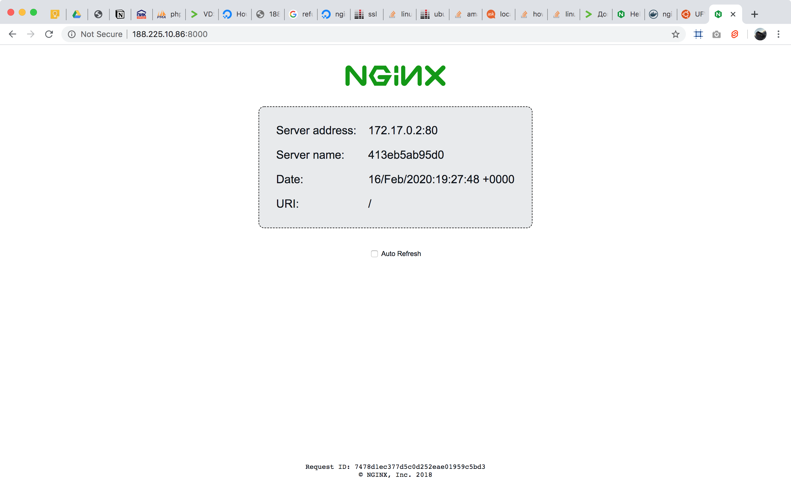

Initial setup tool for `ubuntu 18.04` remote servers based on `ansible-playbook`.
To run this tool you have to take a look at [the requirements below](https://github.com/gustarus/initial-server-setup#which-requirements-does-this-tool-have).

## What does this tool do?
All this steps will be produced on your remote server in **default** configuration.

```bash
initial-server-setup setup --host 123.456.78.90 
```

⚠️ **Be careful**: after this steps you will be able to login **only** with passed ssh keys (without password) with `default` or `root` users.
To add more ssh keys to login from your another control nodes [you have to install those ssh keys](https://github.com/gustarus/initial-server-setup#install-additional-ssh-keys-to-remote-server) before. 

1. [Initial ubuntu server configuration](https://www.digitalocean.com/community/tutorials/how-to-use-ansible-to-automate-initial-server-setup-on-ubuntu-18-04):
   1. install [curl](https://www.tutorialspoint.com/unix_commands/curl.htm) for transferring data with urls;
   2. install [vim](https://www.computerhope.com/unix/vim.htm) text editor to edit text files;
   3. install [ufw](https://help.ubuntu.com/community/UFW) firewall to protect ports;
   4. install [git](https://git-scm.com/book/en/v2) version control to manage repositories.
   5. create new user `default` with sudo privileges and ability to login to remote server with your local public ssh key (`~/.ssh/id_rsa.pub`);
   6. disable [remote root login with password](https://ubuntuforums.org/showthread.php?t=2359172) with `PermitRootLogin prohibit-password`;
   7. setup [ufw tool](https://help.ubuntu.com/community/UFW) to allow **only** ssh connections and some ports (`http:80`, `https:443`, `:8000`).
2. [Install and configure docker-ce toolbox](https://www.digitalocean.com/community/tutorials/how-to-use-ansible-to-install-and-set-up-docker-on-ubuntu-18-04) and do post-installation steps:
   1. install [docker](https://www.digitalocean.com/community/tutorials/how-to-install-and-use-docker-on-ubuntu-18-04) to manage containers;
   2. configure crontab for `root` to run `docker system prune --all --force` every night to clean detached images and other docker stuff to free space after deployments.
   3. add user `default` to docker administrators group;
   4. pull hello nginx container [nginxdemos/hello](https://hub.docker.com/r/nginxdemos/hello/);
   5. run hello container on `:8001` port inside `localhost` (the container isn't published to the internet yet on this step).
3. [Install and configure nginx](https://code-maven.com/install-and-configure-nginx-using-ansible):
   1. install [nginx](https://www.nginx.com) to manage web servers;
   2. configure nginx with [default configuration](templates/nginx.conf);
   3. add [default server](templates/default.conf) to proxy all requests from public `:8000` port to the nginx hello container.
   4. restart nginx.

As the result you will get configured web server with nginx layer to manage web servers and with docker to run containers inside remote machine.
Also you have to be able to see the result of [nginxdemos/hello](https://hub.docker.com/r/nginxdemos/hello/) container on `your-domain.com:8000`.
And you will be able to login to your remote server with `ssh <default|root>@<remote-server-ip|remote-server-domain>`. 



## Which requirements does this tool have?
### Server node requirements
Server node is a node where you want to configure the environment.
- [ubuntu 18.04](http://releases.ubuntu.com/18.04/).

### Control node requirements
Control node is a node from what you are going to run setup tool.
- [ssh](https://www.ssh.com/ssh/command/) tool with [ssh copy id](https://www.ssh.com/ssh/copy-id) to install your public ssh key inside the remote server;
- [generated ssh keys](https://help.github.com/en/github/authenticating-to-github/generating-a-new-ssh-key-and-adding-it-to-the-ssh-agent) to connect to your remote server;
- [node.js 10](https://nodejs.org/en/download/) to run this tool from console (you can use [nvm](https://github.com/nvm-sh/nvm));
- [ansible](https://docs.ansible.com/ansible/latest/installation_guide/intro_installation.html) to run playbooks inside the remote server.

## How to install this tool?
```bash
npm i -g initial-server-setup
```

## How to use this tool?
Basic configuration uses `root` user to login into remote server and `~/.ssh/id_rsa.pub` to install ssh key inside remote server.
Also this tool creates user `default` to login into remote server with `~/.ssh/id_rsa.pub` key.
```bash
initial-server-setup setup --host 123.456.78.90
```

### Options to configure the tool
You can define the following options and full command will be like.
```bash
initial-server-setup setup --host 123.456.78.90 --root-user root --root-key ~/.ssh/id_rsa.pub --target-user default --target-key ~/.ssh/id_rsa.pub
``` 

Option | Default | Required | Description 
--- | --- | --- | ---
`host` | | `+` | Remote server `ip` or `domain`.
`root-user` | `root` | `-` | Remote `sudo` user to login into clean server.
`root-key` | `~/.ssh/id_rsa.pub` | `-` | Remote `sudo` user key to install inside remote server.
`target-user` | `default` | `-` | Remote `admin` user to create with `sudo` privileges.
`target-key` | `~/.ssh/id_rsa.pub` | `-` | Remote `admin` user key to install inside remote server.


### Existed commands in the tool
You can use any command separately and every command has it own `--help`.
```bash
initial-server-setup setup-docker --help
```

Command | Description 
--- | ---
`setup` [options] | General command to run all `setup-*` commands.
`setup-key` [options] | Install local public key to remote host.
`setup-ubuntu` [options] | Do initial ubuntu setup.
`setup-docker` [options] | Do docker-ce setup and run `hello` container.
`setup-nginx` [options] | Do nginx setup and run `hello` server for the `hello` container. 

### Install additional ssh keys to remote server
Copy and paste your ssh public key from another control node to what you want to give access via the following command (do not forget to use `-f` flag).
```bash
ssh-copy-id -f -i ~/.ssh/different-key.pub <remote-server-ip|remote-server-domain>
```
