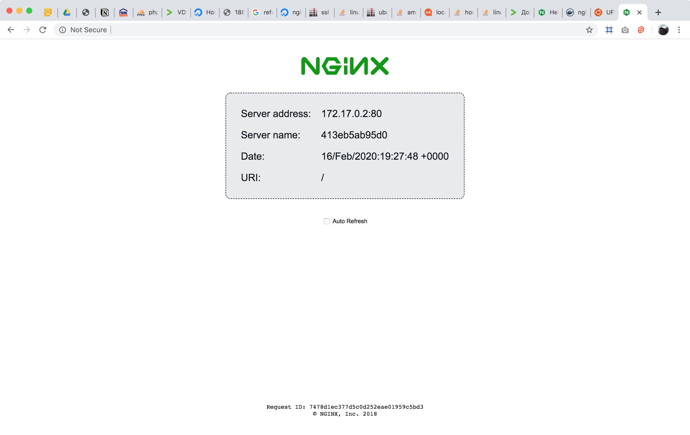

Initial setup tool for `ubuntu 18.04` remote servers based on `ansible-playbook`.
To run this tool you have to take a look at the requirements below.

## What does this tool do?
All this steps will be produced on your remote server.
1. [Initial ubuntu server configuration](https://www.digitalocean.com/community/tutorials/how-to-use-ansible-to-automate-initial-server-setup-on-ubuntu-18-04) to create new user `default` with your public ssh key, disable ssh root login with password and setup [ufw tool](https://help.ubuntu.com/community/UFW) to allow **only** ssh connections and some ports (`http:80`, `https:443`, `:8000`).
2. [Install and configure docker-ce toolbox](https://www.digitalocean.com/community/tutorials/how-to-use-ansible-to-install-and-set-up-docker-on-ubuntu-18-04) and run [nginxdemos/hello](https://hub.docker.com/r/nginxdemos/hello/) container on `:8001` port inside `localhost`.
3. [Install and configure nginx](https://code-maven.com/install-and-configure-nginx-using-ansible) with [default configuration](templates/nginx.conf) and [default server](templates/default.conf) and proxy all requests from public `:8000` port to the [nginxdemos/hello](https://hub.docker.com/r/nginxdemos/hello/) container.

As the result you will have configured web server to run docker containers inside.
Also you have to be able to see the result of [nginxdemos/hello](https://hub.docker.com/r/nginxdemos/hello/) container on `your-domain.com:8000`.



## Which requirements does this tool have?
### Server node requirements
Server node is a node where you want to configure the environment.
- [Ubuntu 18.04](http://releases.ubuntu.com/18.04/).

### Control node requirements
Control node is a node from what you are going to run setup tool.
- [Node.js](https://nodejs.org/en/download/)@10.16.0 to run this tool from console (you can use [nvm](https://github.com/nvm-sh/nvm)).
- [SSH Copy id](https://www.ssh.com/ssh/copy-id) to install your public ssh key inside the remote server.
- [Ansible](https://docs.ansible.com/ansible/latest/installation_guide/intro_installation.html) to run playbooks inside the remote server.

## How to install this tool?
```bash
npm i -g initial-server-setup
```

## How to use this tool?
Basic configuration uses `root` user to login into remote server and `~/.ssh/id_rsa.pub` to install ssh key inside remote server.
Also this tool creates user `default` to login into remote server with `~/.ssh/id_rsa.pub` key.
```bash
initial-server-setup setup --host 123.456.78.90
```

### Options to configure the tool
You can define the following options and full command will be like.
```bash
initial-server-setup setup --host 123.456.78.90 --root-user root --root-key ~/.ssh/id_rsa.pub --target-user default --target-key ~/.ssh/id_rsa.pub
``` 

Option | Default | Required | Description 
--- | --- | --- | ---
`host` | | `+` | Remote server `ip` or `domain`.
`root-user` | `root` | `-` | Remote `sudo` user to login into clean server.
`root-key` | `~/.ssh/id_rsa.pub` | `-` | Remote `sudo` user key to install inside remote server.
`target-user` | `default` | `-` | Remote `admin` user to create with `sudo` privileges.
`target-key` | `~/.ssh/id_rsa.pub` | `-` | Remote `admin` user key to install inside remote server.


### Existed commands in the tool
You can use any command separately and every command has it own `--help`.
```bash
initial-server-setup setup --help
```

Command | Description 
--- | ---
`setup` [options] | General command to run all `setup-*` commands.
`setup-key` [options] | Install local public key to remote host.
`setup-ubuntu` [options] | Do initial ubuntu setup.
`setup-docker` [options] | Do docker-ce setup and run `hello` container.
`setup-nginx` [options] | Do nginx setup and run `hello` server for the container. 
